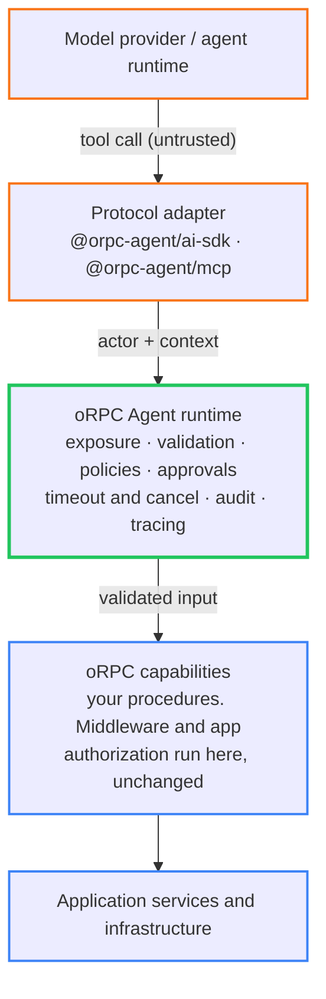
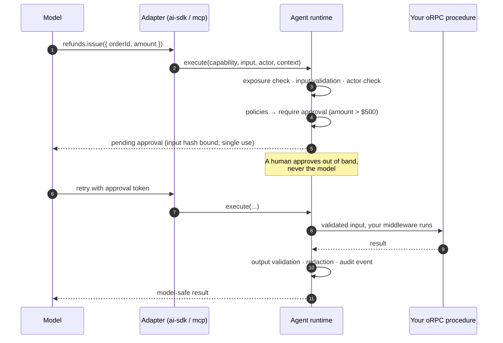

<div align="center">

# oRPC Agent

**Make agents first-class clients of your oRPC application.**

[](https://github.com/Wiseair-srl/orpc-agent/actions/workflows/ci.yml)
[](LICENSE)
[](package.json)
[](https://www.npmjs.com/package/@orpc-agent/core)

[Getting started](docs/getting-started.md) · [Architecture](docs/architecture/execution-pipeline.md) · [Security model](docs/security/security-model.md) · [Examples](docs/examples/customer-support-agent.md) · [Roadmap](ROADMAP.md)

</div>

Your application UI, an AI runtime, an MCP client, a workflow, and your tests can all call the same typed oRPC procedures, under one set of validation rules, permissions, approvals, execution policies, and observability.

> [!NOTE]
> **Published to npm** at **2.0.0** under `@orpc-agent/*`: [`core`](https://www.npmjs.com/package/@orpc-agent/core), [`ai-sdk`](https://www.npmjs.com/package/@orpc-agent/ai-sdk), [`mcp`](https://www.npmjs.com/package/@orpc-agent/mcp), [`postgres`](https://www.npmjs.com/package/@orpc-agent/postgres), [`opentelemetry`](https://www.npmjs.com/package/@orpc-agent/opentelemetry), [`testing`](https://www.npmjs.com/package/@orpc-agent/testing), and [`cli`](https://www.npmjs.com/package/@orpc-agent/cli). Upgrading from 1.x is [one field read, if that](docs/migration/1-to-2.md). CI runs the governance suite on every push (plus a real-Postgres pass) and gates the examples' committed capability snapshots.

```bash
pnpm add @orpc-agent/core @orpc/server
```

```bash
# or try it from a clean checkout
pnpm install && pnpm build && pnpm test
pnpm --filter customer-support-example demo   # the documented end-to-end flow, scripted
pnpm --filter mastra-task-board-example dev   # full-stack example: board UI + Mastra agent
pnpm docs:dev                                 # browse the documentation site locally
```

## The idea

An AI agent must not call business logic directly. It requests a capability: an ordinary oRPC procedure carrying explicit governance metadata, which says where it is exposed, whether it writes, how risky it is, which policies and approvals apply, and what gets redacted on the way out.

> Define a capability once. Expose it through multiple governed surfaces.



Everything above the runtime is untrusted. Everything below it is your application, unchanged.

## Why

Teams with typed oRPC procedures keep re-implementing them as hand-written AI tools. The schemas get duplicated and drift apart, auth is written per tool, string errors leak internals, nothing is audited, and there is no story for approvals. Meanwhile "the model can't see the tool" gets mistaken for security.

oRPC Agent sits between agent runtimes and business logic. It agent-enables an existing oRPC application instead of asking you to adopt a new full-stack framework, and it treats the model end of every surface as untrusted input. The scope stays narrow on purpose: no opinion about your UI, database, auth provider, model provider, or workflow engine.

## Quick start

```ts
import { os } from "@orpc/server";
import { agentProcedure, createCapabilityRegistry, defineGovernance, createAgentRuntime } from "@orpc-agent/core";
import { toAISDKTools } from "@orpc-agent/ai-sdk";
import * as z from "zod";

// 1. Type your existing base for agents (adds typing only)
const agentBase = agentProcedure(os.$context<AppContext>().use(requireSession));

// 2. An annotated procedure is a capability — deny-by-default exposure
export const searchOrders = agentBase
  .meta({
    agent: {
      description: "Search orders by customer email or order number.",
      expose: { aiSdk: true },
      sideEffect: "read",
      risk: "low",
    },
  })
  .input(z.strictObject({ query: z.string().min(2) }))
  .output(z.object({ orders: z.array(OrderSummary) }))
  .handler(async ({ input, context, signal }) => ({ orders: await context.orders.search(input, { signal }) }));

// 3. Registry, declared governance, governed runtime
const capabilities = createCapabilityRegistry({ orders: { search: searchOrders } });
const governance = defineGovernance({ registry: capabilities });   // + policies: [...]
const runtime = createAgentRuntime({ governance });

// 4. Per-request tools for your model loop — actor = authenticated identity, never the model
const tools = await toAISDKTools(runtime, { actor, context });
```

Full walkthrough: [docs/getting-started.md](docs/getting-started.md).

## What happens on a call

Every invocation goes through the same [15 stages](docs/architecture/execution-pipeline.md), in the same order, on every surface. A refund that needs a manager looks like this:



## What it gives you

Procedures are the single source of truth, and a "tool" is only how an adapter represents one ([ADR-001](docs/architecture/decisions.md#adr-001-orpc-procedures-are-the-source-of-truth), [ADR-002](docs/architecture/decisions.md#adr-002-capability-is-the-internal-abstraction)). On top of that:

- Exposure is explicit and per surface, denied by default across `direct`, `aiSdk`, `mcp`, `workflow`, and `test`
- One governed pipeline handles validation, policies, approvals, timeout and cancellation, retries, redaction, and error normalization
- Policies are deterministic: allow, deny, hide, or require approval, with deny winning and failures closing the gate
- Approvals are hash-bound to the exact validated input, single-use, expiring, and never self-granted
- Errors have two faces: a model-safe public one and private diagnostics, with concealment for hidden capabilities
- Audit events and OpenTelemetry spans are storage-neutral and carry no payloads by default
- Tests assert exposure, policies, approvals, and redaction with no LLM in the loop

## Security model

Everything model-side of the adapter is untrusted. Twelve binding invariants (SI-1 to SI-12) hold the design together:

- Exposure is denied by default, and enforcement happens at execution time. Filtering the tool list is UX, not security
- The model is never the actor, and approvals come from outside the model and bind the exact input
- Policy failures fail closed. A hidden capability and a nonexistent one look identical from the outside
- Internals never reach models. Audit records and traces carry no payloads by default
- Writes are never auto-retried, and every execution is bounded and cancellable

Your oRPC middleware stays the authoritative authorization layer on every call. What this does not claim: solving prompt injection (it bounds the impact, not the occurrence), exactly-once execution, or safety without application-level authorization. Read the [security model](docs/security/security-model.md) and the [threat model](docs/security/threat-model.md).

## Packages

| Package | Purpose |
|---|---|
| `@orpc-agent/core` | Capability model, registry, runtime, policies, approvals, errors, events. No provider or protocol dependencies |
| `@orpc-agent/ai-sdk` | Vercel AI SDK tools over the runtime (`ai@^5 || ^6`) |
| `@orpc-agent/mcp` | MCP server adapter with per-session identity |
| `@orpc-agent/postgres` | Reference Postgres approval coordinator + audit sink (driver-agnostic) |
| `@orpc-agent/opentelemetry` | Tracing adapter (spans and conventions) |
| `@orpc-agent/testing` | Deterministic governance testing |
| `@orpc-agent/cli` | `orpc-agent` — capability inventory and CI drift gate ([reference](docs/reference/cli.md)) |

Boundaries and rules: [package-boundaries](docs/architecture/package-boundaries.md).

## Catching exposure changes in review

Commit a capability snapshot and let CI fail when the reachable surface moves:

```bash
npx orpc-agent snapshot        # writes capabilities.snapshot.json
npx orpc-agent check           # exit 1 if the app no longer matches it
```

The snapshot is deterministic, so every diff is a real change — and `check` says what each one *means*, not just that it happened:

```
Capability drift — 3 changes, 2 widening

WIDENING — the agent gained reach, or a control weakened
  orders.refund   expose    now exposed on mcp
  billing.charge  approval  approval no longer required
```

Two classifications are deliberately counter-intuitive. A `sideEffect` change counts as widening **in both directions**, because declaring less than before silently stops every policy keyed on the old value from matching. And `idempotent: false → true` is widening, because it is the flag that lets the runtime retry a write. Full rules, and an explicit list of what the tool cannot see: [reference/cli](docs/reference/cli.md).

## Examples

**Customer-support agent** (flagship). A dashboard UI, an AI assistant, and an MCP endpoint share nine governed capabilities. Refunds over $500 need manager approval, bound to the input hash and usable once. Sending a customer message needs human confirmation. Refunds are not exposed over MCP at all. PII is redacted from model-visible output, and every step lands in the audit trail. Narrative, code, and failure branches: [docs/examples/customer-support-agent.md](docs/examples/customer-support-agent.md).

**Mastra task board** (full-stack). A React board on plain typed oRPC, plus a [Mastra](https://mastra.ai) chat agent that reaches the same four capabilities through the governed runtime, with approvals in the UI, redaction, and a live audit ledger. Model-agnostic via OpenRouter. Run it with `pnpm --filter mastra-task-board-example dev` (needs Node 22.13 or later). Walkthrough: [docs/examples/mastra-task-board.md](docs/examples/mastra-task-board.md).

## Non-goals

No agent loop, planner, prompts, or memory. No workflow engine, though durable execution integrates via adapters. No bundled databases for approvals or audit, no auth provider, no UI framework, no exactly-once claims. It does not replace oRPC either. It requires it. Full list: [ROADMAP, non-goals](ROADMAP.md#non-goals-permanent).

## Roadmap

Semver applies strictly: a breaking change means a major, never a minor with migration notes ([release process](docs/contributing/release-process.md)). **2.0 "Discovery at scale"** added `scope` on `describe`, bounded discovery concurrency, and a constant-size discovery audit event — the one breaking part is [a single field read](docs/migration/1-to-2.md). Next: the workflow-engine adapter, MCP dynamic listings, streaming capabilities, quotas. Details and open questions in [ROADMAP.md](ROADMAP.md) and [docs/open-questions.md](docs/open-questions.md).

## Contributing

Design review, security analysis, and doc fixes are the most useful contributions. Start with [CONTRIBUTING.md](CONTRIBUTING.md), report security issues via [SECURITY.md](SECURITY.md), follow the [Code of Conduct](CODE_OF_CONDUCT.md), and see [GOVERNANCE.md](GOVERNANCE.md) for how decisions get made.

## License and independence

MIT. oRPC Agent is an independent community project, not affiliated with, endorsed by, or maintained by the oRPC project. It builds on oRPC with respect and gratitude, and if the oRPC maintainers ever want this work closer to home, the door is open ([ADR-011](docs/architecture/decisions.md#adr-011-npm-scope-and-project-independence)).
